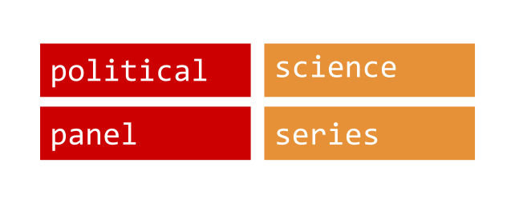

## Problems (1)

 
 

Political science/panel-series data, when it's available,  

Political scientists waste *a lot* of time downloading and cleaning commonly used data sets.

---

## Future: 

 
 

From hack to framework

